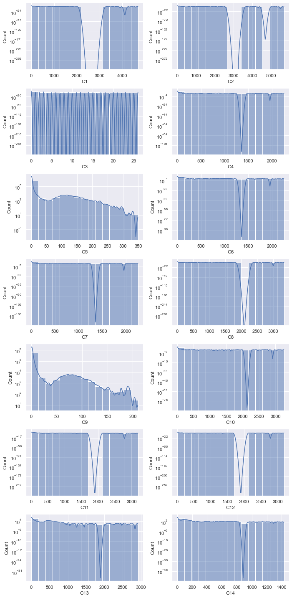
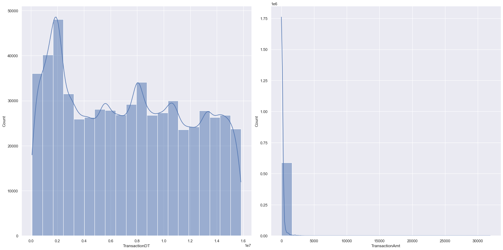
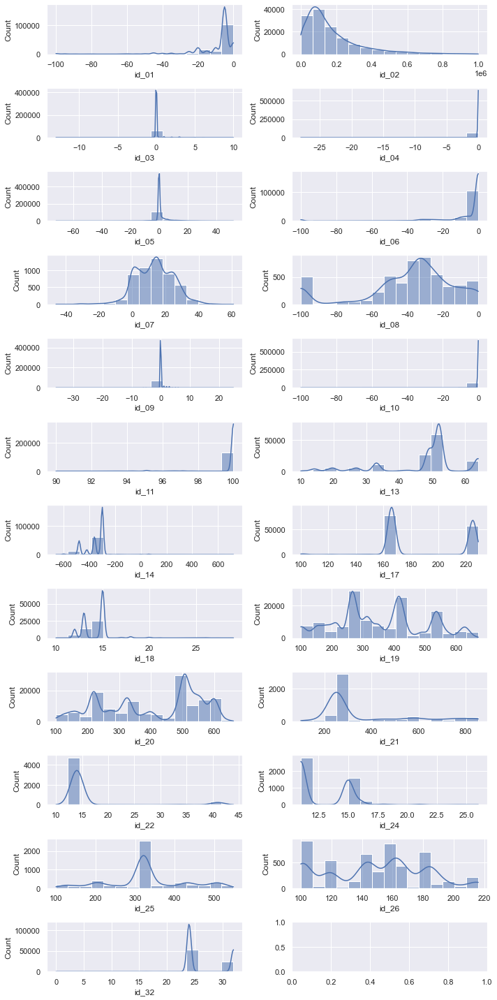

# Описание таблиц

Датасет делится на 2 части, каждая из которых делится на трейн и тест соответственно.

## Первая часть - transaction table
Переменные в этой таблице - это идентификационная информация, необходимая для описания характеристик транзакций. К таким характеристикам относятся тип сетевого подключения(IP, ISP, Proxy и т.д.) или электронная подпись (UA/browser/os/version и т.д.).

*Описание столбцов:*  
<table >
<tr><th >Название признака <th><th> Описание <th><th> Тип данных <th><th> Количество классов <th><th> Пропущенные значения <tr><tr>
<tr><td> TransactionId <td><td> Id транзакции <td><td> int64 <td><td> $-$ <td><td> Пропусков 0%. Заполнено целиком. <td><tr>
<tr><td> TransactionDT <td><td> временной промежуток, время выполнения транзакции<td><td> int64 <td><td> $-$ <td><td> Пропусков 0%. Заполнено целиком.<td><tr>
<tr><td> TransactionAMT<td><td> сумма перевода в USD <td><td> float64 <td><td> $-$ <td><td> Пропусков 0%. Заполнено целиком. <td><tr>
<tr><td> ProductCD <td><td> Продуктовый код <td><td> object <td><td> 5 <td><td> Пропусков 0%. Заполнено целиком. <td><tr> 
<tr><td> card1 - card6 <td><td> характеристика платежа, например: тип карты с которой осуществлялся платеж, категория карты, банк, страна и т.д.<td><td> int64/float64/object <td><td> 4 <td><td> 27% Пропусков. <td><tr>
<tr><td> addr1<td><td> Адрес<td><td> float64 <td><td> $-$ <td><td> 11% Пропусков. <td><tr> 
<tr><td> addr2<td><td> Адрес <td><td> float64 <td><td> $-$ <td><td> 11% Пропусков. <td><tr> 
<tr><td> dist<td><td> Дистанция <td><td> float64 <td><td> $-$ <td><td> dist1 - 60% пропусков, dist2 - 93% пропусков. <td><tr> 
<tr><td> P_emaildomain<td><td> Домен почты отправителя<td><td> object <td><td> 59 <td><td> 15% Пропусков.<td><tr> 
<tr><td> R_emaildomain<td><td> Домен почты получателя<td><td> object <td><td> 60 <td><td> 76% Пропусков. У большей части отсутствует домен получателя.<td><tr> 
<tr><td> C1-C14 <td><td> Истинное значение скрыто в целях информационной безопасности <td><td> float64 <td><td> $-$ <td><td> Пропусков 0%. Заполнено целиком. <td><td> <td><tr> 
<tr><td> D1-D15 <td><td> Временные дельты (например, разница во времени между текущей и прошлой транзакциями)<td><td> int64/float64 <td><td> $-$ <td><td> Большая часть незаполнена на 80-90%. Много разреженных признаков.<td><tr> 
<tr><td> M1-M9 <td><td> Совпадение в данных между отправителем и получаетем <td><td> object <td><td> 2-3. В основном значения True/False. <td><td> Большая часть признаков заполнена только на 55%. <td><tr> 
<tr><td> Vxxx <td><td> Дополнительные характеристики, такие как ранг клиента, счета и т.д.<td><td> float64 <td><td> $-$<td><td>% пропусков варьируется. Где-то меньше 1%, где-то больше 80%. Самое главное, на что стоит обратить внимание - часть столбцов зависима от других (это заметно по повторяющемуся проценту пропусков).<td><tr> 
<tr><td> IsFraud <td><td> Флаг, который определяет является ли транзакция фродом или нет. Целевой признак. <td><td> object <td><td> 2 класса - 0 и 1 <td><td> Пропусков 0%. Заполнено целиком. <td><tr> 
<table>

### Категориальные признаки

<table border="1" class="dataframe">
  <thead>
    <tr style="text-align: right;">
      <th></th>
      <th>isFraud</th>
      <th>Доля объектов класса</th>
    </tr>
  </thead>
  <tbody>
    <tr>
      <th>0</th>
      <td>0</td>
      <td>0.96501</td>
    </tr>
    <tr>
      <th>1</th>
      <td>1</td>
      <td>0.03499</td>
    </tr>
  </tbody>
</table>

    Признак: ProductCD
    Кол-во классов: 5
    Тип частотности признака: низкокардинальное
    % Пропусков: 0. Не разреженное поле.
    Кол-во объектов каждого класса

<table border="1" class="dataframe">
  <thead>
    <tr style="text-align: right;">
      <th></th>
      <th>ProductCD</th>
      <th>Доля объектов класса</th>
    </tr>
  </thead>
  <tbody>
    <tr>
      <th>0</th>
      <td>W</td>
      <td>0.744522</td>
    </tr>
    <tr>
      <th>1</th>
      <td>C</td>
      <td>0.116028</td>
    </tr>
    <tr>
      <th>2</th>
      <td>R</td>
      <td>0.063838</td>
    </tr>
    <tr>
      <th>3</th>
      <td>H</td>
      <td>0.055922</td>
    </tr>
    <tr>
      <th>4</th>
      <td>S</td>
      <td>0.019690</td>
    </tr>
  </tbody>
</table>

    Признак: card4
    Кол-во классов: 4
    Тип частотности признака: низкокардинальное
    % Пропусков: 0.27. Не разреженное поле.
    Кол-во объектов каждого класса

<table border="1" class="dataframe">
  <thead>
    <tr style="text-align: right;">
      <th></th>
      <th>card4</th>
      <th>Доля объектов класса</th>
    </tr>
  </thead>
  <tbody>
    <tr>
      <th>0</th>
      <td>visa</td>
      <td>0.651551</td>
    </tr>
    <tr>
      <th>1</th>
      <td>mastercard</td>
      <td>0.320414</td>
    </tr>
    <tr>
      <th>2</th>
      <td>american express</td>
      <td>0.014102</td>
    </tr>
    <tr>
      <th>3</th>
      <td>discover</td>
      <td>0.011263</td>
    </tr>
    <tr>
      <th>4</th>
      <td>NaN</td>
      <td>0.002670</td>
    </tr>
  </tbody>
</table>

    Признак: card6
    Кол-во классов: 4
    Тип частотности признака: низкокардинальное
    % Пропусков: 0.27. Не разреженное поле.
    Кол-во объектов каждого класса

<table border="1" class="dataframe">
  <thead>
    <tr style="text-align: right;">
      <th></th>
      <th>card6</th>
      <th>Доля объектов класса</th>
    </tr>
  </thead>
  <tbody>
    <tr>
      <th>0</th>
      <td>debit</td>
      <td>0.744976</td>
    </tr>
    <tr>
      <th>1</th>
      <td>credit</td>
      <td>0.252288</td>
    </tr>
    <tr>
      <th>2</th>
      <td>NaN</td>
      <td>0.002660</td>
    </tr>
    <tr>
      <th>3</th>
      <td>debit or credit</td>
      <td>0.000051</td>
    </tr>
    <tr>
      <th>4</th>
      <td>charge card</td>
      <td>0.000025</td>
    </tr>
  </tbody>
</table>

    Признак: P_emaildomain
    Кол-во классов: 59
    Тип частотности признака: высококардинальное
    % Пропусков: 15.989999999999998. Не разреженное поле.
    Кол-во объектов каждого класса

<table border="1" class="dataframe">
  <thead>
    <tr style="text-align: right;">
      <th></th>
      <th>P_emaildomain</th>
      <th>Доля объектов класса</th>
    </tr>
  </thead>
  <tbody>
    <tr>
      <th>0</th>
      <td>gmail.com</td>
      <td>0.386688</td>
    </tr>
    <tr>
      <th>1</th>
      <td>yahoo.com</td>
      <td>0.170918</td>
    </tr>
    <tr>
      <th>2</th>
      <td>NaN</td>
      <td>0.159949</td>
    </tr>
    <tr>
      <th>3</th>
      <td>hotmail.com</td>
      <td>0.076625</td>
    </tr>
    <tr>
      <th>4</th>
      <td>anonymous.com</td>
      <td>0.062651</td>
    </tr>
  </tbody>
</table>

    Признак: R_emaildomain
    Кол-во классов: 60
    Тип частотности признака: высококардинальное
    % Пропусков: 76.75. Разреженное поле.
    Кол-во объектов каждого класса

<table border="1" class="dataframe">
  <thead>
    <tr style="text-align: right;">
      <th></th>
      <th>R_emaildomain</th>
      <th>Доля объектов класса</th>
    </tr>
  </thead>
  <tbody>
    <tr>
      <th>0</th>
      <td>NaN</td>
      <td>0.767516</td>
    </tr>
    <tr>
      <th>1</th>
      <td>gmail.com</td>
      <td>0.096771</td>
    </tr>
    <tr>
      <th>2</th>
      <td>hotmail.com</td>
      <td>0.046583</td>
    </tr>
    <tr>
      <th>3</th>
      <td>anonymous.com</td>
      <td>0.034763</td>
    </tr>
    <tr>
      <th>4</th>
      <td>yahoo.com</td>
      <td>0.020053</td>
    </tr>
  </tbody>
</table>

    Признак: M1
    Кол-во классов: 2
    Тип частотности признака: низкокардинальное
    % Пропусков: 45.910000000000004. Не разреженное поле.
    Кол-во объектов каждого класса

<table border="1" class="dataframe">
  <thead>
    <tr style="text-align: right;">
      <th></th>
      <th>M1</th>
      <th>Доля объектов класса</th>
    </tr>
  </thead>
  <tbody>
    <tr>
      <th>0</th>
      <td>T</td>
      <td>0.540886</td>
    </tr>
    <tr>
      <th>1</th>
      <td>NaN</td>
      <td>0.459071</td>
    </tr>
    <tr>
      <th>2</th>
      <td>F</td>
      <td>0.000042</td>
    </tr>
  </tbody>
</table>

    Признак: M2
    Кол-во классов: 2
    Тип частотности признака: низкокардинальное
    % Пропусков: 45.910000000000004. Не разреженное поле.
    Кол-во объектов каждого класса

<table border="1" class="dataframe">
  <thead>
    <tr style="text-align: right;">
      <th></th>
      <th>M2</th>
      <th>Доля объектов класса</th>
    </tr>
  </thead>
  <tbody>
    <tr>
      <th>0</th>
      <td>T</td>
      <td>0.483402</td>
    </tr>
    <tr>
      <th>1</th>
      <td>NaN</td>
      <td>0.459071</td>
    </tr>
    <tr>
      <th>2</th>
      <td>F</td>
      <td>0.057527</td>
    </tr>
  </tbody>
</table>

    Признак: M3
    Кол-во классов: 2
    Тип частотности признака: низкокардинальное
    % Пропусков: 45.910000000000004. Не разреженное поле.
    Кол-во объектов каждого класса

<table border="1" class="dataframe">
  <thead>
    <tr style="text-align: right;">
      <th></th>
      <th>M3</th>
      <th>Доля объектов класса</th>
    </tr>
  </thead>
  <tbody>
    <tr>
      <th>0</th>
      <td>NaN</td>
      <td>0.459071</td>
    </tr>
    <tr>
      <th>1</th>
      <td>T</td>
      <td>0.426273</td>
    </tr>
    <tr>
      <th>2</th>
      <td>F</td>
      <td>0.114656</td>
    </tr>
  </tbody>
</table>

    Признак: M4
    Кол-во классов: 3
    Тип частотности признака: низкокардинальное
    % Пропусков: 47.660000000000004. Не разреженное поле.
    Кол-во объектов каждого класса

<table border="1" class="dataframe">
  <thead>
    <tr style="text-align: right;">
      <th></th>
      <th>M4</th>
      <th>Доля объектов класса</th>
    </tr>
  </thead>
  <tbody>
    <tr>
      <th>0</th>
      <td>NaN</td>
      <td>0.476588</td>
    </tr>
    <tr>
      <th>1</th>
      <td>M0</td>
      <td>0.332585</td>
    </tr>
    <tr>
      <th>2</th>
      <td>M2</td>
      <td>0.101373</td>
    </tr>
    <tr>
      <th>3</th>
      <td>M1</td>
      <td>0.089454</td>
    </tr>
  </tbody>
</table>

    Признак: M5
    Кол-во классов: 2
    Тип частотности признака: низкокардинальное
    % Пропусков: 59.35. Разреженное поле.
    Кол-во объектов каждого класса

<table border="1" class="dataframe">
  <thead>
    <tr style="text-align: right;">
      <th></th>
      <th>M5</th>
      <th>Доля объектов класса</th>
    </tr>
  </thead>
  <tbody>
    <tr>
      <th>0</th>
      <td>NaN</td>
      <td>0.593494</td>
    </tr>
    <tr>
      <th>1</th>
      <td>F</td>
      <td>0.224356</td>
    </tr>
    <tr>
      <th>2</th>
      <td>T</td>
      <td>0.182150</td>
    </tr>
  </tbody>
</table>

    Признак: M6
    Кол-во классов: 2
    Тип частотности признака: низкокардинальное
    % Пропусков: 28.68. Не разреженное поле.
    Кол-во объектов каждого класса

<table border="1" class="dataframe">
  <thead>
    <tr style="text-align: right;">
      <th></th>
      <th>M6</th>
      <th>Доля объектов класса</th>
    </tr>
  </thead>
  <tbody>
    <tr>
      <th>0</th>
      <td>F</td>
      <td>0.385843</td>
    </tr>
    <tr>
      <th>1</th>
      <td>T</td>
      <td>0.327368</td>
    </tr>
    <tr>
      <th>2</th>
      <td>NaN</td>
      <td>0.286788</td>
    </tr>
  </tbody>
</table>

    Признак: M7
    Кол-во классов: 2
    Тип частотности признака: низкокардинальное
    % Пропусков: 58.64. Разреженное поле.
    Кол-во объектов каждого класса

<table border="1" class="dataframe">
  <thead>
    <tr style="text-align: right;">
      <th></th>
      <th>M7</th>
      <th>Доля объектов класса</th>
    </tr>
  </thead>
  <tbody>
    <tr>
      <th>0</th>
      <td>NaN</td>
      <td>0.586353</td>
    </tr>
    <tr>
      <th>1</th>
      <td>F</td>
      <td>0.357933</td>
    </tr>
    <tr>
      <th>2</th>
      <td>T</td>
      <td>0.055713</td>
    </tr>
  </tbody>
</table>

    Признак: M8
    Кол-во классов: 2
    Тип частотности признака: низкокардинальное
    % Пропусков: 58.63. Разреженное поле.
    Кол-во объектов каждого класса

<table border="1" class="dataframe">
  <thead>
    <tr style="text-align: right;">
      <th></th>
      <th>M8</th>
      <th>Доля объектов класса</th>
    </tr>
  </thead>
  <tbody>
    <tr>
      <th>0</th>
      <td>NaN</td>
      <td>0.586331</td>
    </tr>
    <tr>
      <th>1</th>
      <td>F</td>
      <td>0.262897</td>
    </tr>
    <tr>
      <th>2</th>
      <td>T</td>
      <td>0.150772</td>
    </tr>
  </tbody>
</table>

    Признак: M9
    Кол-во классов: 2
    Тип частотности признака: низкокардинальное
    % Пропусков: 58.63. Разреженное поле.
    Кол-во объектов каждого класса

<table border="1" class="dataframe">
  <thead>
    <tr style="text-align: right;">
      <th></th>
      <th>M9</th>
      <th>Доля объектов класса</th>
    </tr>
  </thead>
  <tbody>
    <tr>
      <th>0</th>
      <td>NaN</td>
      <td>0.586331</td>
    </tr>
    <tr>
      <th>1</th>
      <td>T</td>
      <td>0.348251</td>
    </tr>
    <tr>
      <th>2</th>
      <td>F</td>
      <td>0.065418</td>
    </tr>
  </tbody>
</table>

Основные выводы:
- Классы целевого признака не сбалансированны. Класс Fraud составляет только 3%.
- Есть много зависимых друг от друга признаков, что заметно практически сразу, достаточно посмотреть на распределение.
- Часть признаков сложно интерпретировать в силу того, что смысл был намерено скрыт организаторами.
- Большая часть категориальных признаков - бинарные.

### Вещественные признаки
Рассмотрим те признаки, которые больше всего заполнены, а так же те, смысл которых понятен из описания.
    

    
Все признаки группы С, за исключением C3, C5 и C9 похоже распределены, скорее всего их можно заменить на 1. С5 и С9 тоже похожи. По итогу, из 14 признаков можно будет оставить только 3.
    

    
Согласно распределению времени выполнения транзакции, большая часть транзакций выполняется до 0.2 (какой-то временной промежуток, нет уточнения какой именно). Что касается суммы транзакции, есть крупная транзакция, превышающая 30000 USD. Однако, большая часть транзакций не превышает 5000 USD.

## Вторая часть - identity table

Переменные в этой таблице - это идентификационная информация, необходимая для описания характеристик транзакций. К таким характеристикам относятся тип сетевого подключения(IP, ISP, Proxy и т.д.) или электронная подпись (UA/browser/os/version и т.д.).

*Описание столбцов:*  
<table >
    <tr><th >Название признака <th><th> Описание <th><th> Тип данных <th><th> Количество классов <th><th> Пропущенные значения <tr><tr>
    <tr><td> TransactionID <td><td> ID транзакции <td><td> int64  <td><td> $-$ <td><td> $-$ <td><tr>
    <tr><td> id_01-id_38<td><td> характеристики транзакции. названия были скрыты организаторами для того, чтобы обезопасить персональные данные. <td><td> float64/object <td><td> Варьируется от 2 до 260. У большей части категориальных признаков всего два класса. <td><td> Тип данных np.nan. Есть один признак, у которого nan=Unknown. Есть разреженные поля с большим количеством (больше 50%) пропущенных данных. <td><tr>
    <tr><td> DeviceType <td><td> тип устройства через которую была осуществлена транзакция. <td><td> object <td><td> 2 <td><td> Тип данных np.nan. у 2% объектов нет данных. <td><tr>
    <tr><td> DeviceInfo <td><td> вид устройства через которую была осуществлена транзакция. <td><td> object <td><td> 1786<td><td> Тип данных np.nan. У 17% объектов нет данных. <td><tr>
    <table>

### Категориальные признаки

    Признак: id_12
    Кол-во классов: 2
    Тип частотности признака: низкокардинальное
    % Пропусков: 0. Не разреженное поле.
    Кол-во объектов каждого класса

<table border="1" class="dataframe">
  <thead>
    <tr style="text-align: right;">
      <th></th>
      <th>id_12</th>
      <th>Доля объектов класса</th>
    </tr>
  </thead>
  <tbody>
    <tr>
      <th>0</th>
      <td>NotFound</td>
      <td>0.85296</td>
    </tr>
    <tr>
      <th>1</th>
      <td>Found</td>
      <td>0.14704</td>
    </tr>
  </tbody>
</table>

    Признак: id_15
    Кол-во классов: 3
    Тип частотности признака: низкокардинальное
    % Пропусков: 2.25. Не разреженное поле.
    Кол-во объектов каждого класса

<table border="1" class="dataframe">
  <thead>
    <tr style="text-align: right;">
      <th></th>
      <th>id_15</th>
      <th>Доля объектов класса</th>
    </tr>
  </thead>
  <tbody>
    <tr>
      <th>0</th>
      <td>Found</td>
      <td>0.469574</td>
    </tr>
    <tr>
      <th>1</th>
      <td>New</td>
      <td>0.427170</td>
    </tr>
    <tr>
      <th>2</th>
      <td>Unknown</td>
      <td>0.080737</td>
    </tr>
    <tr>
      <th>3</th>
      <td>NaN</td>
      <td>0.022519</td>
    </tr>
  </tbody>
</table>

    Признак: id_16
    Кол-во классов: 2
    Тип частотности признака: низкокардинальное
    % Пропусков: 10.33. Не разреженное поле.
    Кол-во объектов каждого класса

<table border="1" class="dataframe">
  <thead>
    <tr style="text-align: right;">
      <th></th>
      <th>id_16</th>
      <th>Доля объектов класса</th>
    </tr>
  </thead>
  <tbody>
    <tr>
      <th>0</th>
      <td>Found</td>
      <td>0.459839</td>
    </tr>
    <tr>
      <th>1</th>
      <td>NotFound</td>
      <td>0.436904</td>
    </tr>
    <tr>
      <th>2</th>
      <td>NaN</td>
      <td>0.103257</td>
    </tr>
  </tbody>
</table>

    Признак: id_23
    Кол-во классов: 3
    Тип частотности признака: низкокардинальное
    % Пропусков: 96.41999999999999. Разреженное поле.
    Кол-во объектов каждого класса

<table border="1" class="dataframe">
  <thead>
    <tr style="text-align: right;">
      <th></th>
      <th>id_23</th>
      <th>Доля объектов класса</th>
    </tr>
  </thead>
  <tbody>
    <tr>
      <th>0</th>
      <td>NaN</td>
      <td>0.964162</td>
    </tr>
    <tr>
      <th>1</th>
      <td>IP_PROXY:TRANSPARENT</td>
      <td>0.024190</td>
    </tr>
    <tr>
      <th>2</th>
      <td>IP_PROXY:ANONYMOUS</td>
      <td>0.007425</td>
    </tr>
    <tr>
      <th>3</th>
      <td>IP_PROXY:HIDDEN</td>
      <td>0.004222</td>
    </tr>
  </tbody>
</table>

    Признак: id_27
    Кол-во классов: 2
    Тип частотности признака: низкокардинальное
    % Пропусков: 96.41999999999999. Разреженное поле.
    Кол-во объектов каждого класса

<table border="1" class="dataframe">
  <thead>
    <tr style="text-align: right;">
      <th></th>
      <th>id_27</th>
      <th>Доля объектов класса</th>
    </tr>
  </thead>
  <tbody>
    <tr>
      <th>0</th>
      <td>NaN</td>
      <td>0.964162</td>
    </tr>
    <tr>
      <th>1</th>
      <td>Found</td>
      <td>0.035741</td>
    </tr>
    <tr>
      <th>2</th>
      <td>NotFound</td>
      <td>0.000097</td>
    </tr>
  </tbody>
</table>

    Признак: id_28
    Кол-во классов: 2
    Тип частотности признака: низкокардинальное
    % Пропусков: 2.26. Не разреженное поле.
    Кол-во объектов каждого класса

<table border="1" class="dataframe">
  <thead>
    <tr style="text-align: right;">
      <th></th>
      <th>id_28</th>
      <th>Доля объектов класса</th>
    </tr>
  </thead>
  <tbody>
    <tr>
      <th>0</th>
      <td>Found</td>
      <td>0.528534</td>
    </tr>
    <tr>
      <th>1</th>
      <td>New</td>
      <td>0.448899</td>
    </tr>
    <tr>
      <th>2</th>
      <td>NaN</td>
      <td>0.022568</td>
    </tr>
  </tbody>
</table>

    Признак: id_29
    Кол-во классов: 2
    Тип частотности признака: низкокардинальное
    % Пропусков: 2.26. Не разреженное поле.
    Кол-во объектов каждого класса

<table border="1" class="dataframe">
  <thead>
    <tr style="text-align: right;">
      <th></th>
      <th>id_29</th>
      <th>Доля объектов класса</th>
    </tr>
  </thead>
  <tbody>
    <tr>
      <th>0</th>
      <td>Found</td>
      <td>0.519479</td>
    </tr>
    <tr>
      <th>1</th>
      <td>NotFound</td>
      <td>0.457953</td>
    </tr>
    <tr>
      <th>2</th>
      <td>NaN</td>
      <td>0.022568</td>
    </tr>
  </tbody>
</table>

    Признак: id_30
    Кол-во классов: 75
    Тип частотности признака: высококардинальное
    % Пропусков: 46.22. Не разреженное поле.
    Кол-во объектов каждого класса

<table border="1" class="dataframe">
  <thead>
    <tr style="text-align: right;">
      <th></th>
      <th>id_30</th>
      <th>Доля объектов класса</th>
    </tr>
  </thead>
  <tbody>
    <tr>
      <th>0</th>
      <td>NaN</td>
      <td>0.462224</td>
    </tr>
    <tr>
      <th>1</th>
      <td>Windows 10</td>
      <td>0.146672</td>
    </tr>
    <tr>
      <th>2</th>
      <td>Windows 7</td>
      <td>0.090895</td>
    </tr>
    <tr>
      <th>3</th>
      <td>iOS 11.2.1</td>
      <td>0.025805</td>
    </tr>
    <tr>
      <th>4</th>
      <td>iOS 11.1.2</td>
      <td>0.025646</td>
    </tr>
  </tbody>
</table>

    Признак: id_31
    Кол-во классов: 130
    Тип частотности признака: высококардинальное
    % Пропусков: 2.74. Не разреженное поле.
    Кол-во объектов каждого класса

<table border="1" class="dataframe">
  <thead>
    <tr style="text-align: right;">
      <th></th>
      <th>id_31</th>
      <th>Доля объектов класса</th>
    </tr>
  </thead>
  <tbody>
    <tr>
      <th>0</th>
      <td>chrome 63.0</td>
      <td>0.152531</td>
    </tr>
    <tr>
      <th>1</th>
      <td>mobile safari 11.0</td>
      <td>0.093065</td>
    </tr>
    <tr>
      <th>2</th>
      <td>mobile safari generic</td>
      <td>0.079552</td>
    </tr>
    <tr>
      <th>3</th>
      <td>ie 11.0 for desktop</td>
      <td>0.062607</td>
    </tr>
    <tr>
      <th>4</th>
      <td>safari generic</td>
      <td>0.056818</td>
    </tr>
  </tbody>
</table>

    Признак: id_33
    Кол-во классов: 260
    Тип частотности признака: высококардинальное
    % Пропусков: 49.19. Не разреженное поле.
    Кол-во объектов каждого класса

<table border="1" class="dataframe">
  <thead>
    <tr style="text-align: right;">
      <th></th>
      <th>id_33</th>
      <th>Доля объектов класса</th>
    </tr>
  </thead>
  <tbody>
    <tr>
      <th>0</th>
      <td>NaN</td>
      <td>0.491871</td>
    </tr>
    <tr>
      <th>1</th>
      <td>1920x1080</td>
      <td>0.116991</td>
    </tr>
    <tr>
      <th>2</th>
      <td>1366x768</td>
      <td>0.059660</td>
    </tr>
    <tr>
      <th>3</th>
      <td>1334x750</td>
      <td>0.044699</td>
    </tr>
    <tr>
      <th>4</th>
      <td>2208x1242</td>
      <td>0.033973</td>
    </tr>
  </tbody>
</table>

    Признак: id_34
    Кол-во классов: 4
    Тип частотности признака: низкокардинальное
    % Пропусков: 46.06. Не разреженное поле.
    Кол-во объектов каждого класса

<table border="1" class="dataframe">
  <thead>
    <tr style="text-align: right;">
      <th></th>
      <th>id_34</th>
      <th>Доля объектов класса</th>
    </tr>
  </thead>
  <tbody>
    <tr>
      <th>0</th>
      <td>NaN</td>
      <td>0.460560</td>
    </tr>
    <tr>
      <th>1</th>
      <td>match_status:2</td>
      <td>0.416070</td>
    </tr>
    <tr>
      <th>2</th>
      <td>match_status:1</td>
      <td>0.120472</td>
    </tr>
    <tr>
      <th>3</th>
      <td>match_status:0</td>
      <td>0.002877</td>
    </tr>
    <tr>
      <th>4</th>
      <td>match_status:-1</td>
      <td>0.000021</td>
    </tr>
  </tbody>
</table>

    Признак: id_35
    Кол-во классов: 2
    Тип частотности признака: низкокардинальное
    % Пропусков: 2.25. Не разреженное поле.
    Кол-во объектов каждого класса

<table border="1" class="dataframe">
  <thead>
    <tr style="text-align: right;">
      <th></th>
      <th>id_35</th>
      <th>Доля объектов класса</th>
    </tr>
  </thead>
  <tbody>
    <tr>
      <th>0</th>
      <td>T</td>
      <td>0.539502</td>
    </tr>
    <tr>
      <th>1</th>
      <td>F</td>
      <td>0.437979</td>
    </tr>
    <tr>
      <th>2</th>
      <td>NaN</td>
      <td>0.022519</td>
    </tr>
  </tbody>
</table>

    Признак: id_36
    Кол-во классов: 2
    Тип частотности признака: низкокардинальное
    % Пропусков: 2.25. Не разреженное поле.
    Кол-во объектов каждого класса

<table border="1" class="dataframe">
  <thead>
    <tr style="text-align: right;">
      <th></th>
      <th>id_36</th>
      <th>Доля объектов класса</th>
    </tr>
  </thead>
  <tbody>
    <tr>
      <th>0</th>
      <td>F</td>
      <td>0.929510</td>
    </tr>
    <tr>
      <th>1</th>
      <td>T</td>
      <td>0.047971</td>
    </tr>
    <tr>
      <th>2</th>
      <td>NaN</td>
      <td>0.022519</td>
    </tr>
  </tbody>
</table>

    Признак: id_37
    Кол-во классов: 2
    Тип частотности признака: низкокардинальное
    % Пропусков: 2.25. Не разреженное поле.
    Кол-во объектов каждого класса

<table border="1" class="dataframe">
  <thead>
    <tr style="text-align: right;">
      <th></th>
      <th>id_37</th>
      <th>Доля объектов класса</th>
    </tr>
  </thead>
  <tbody>
    <tr>
      <th>0</th>
      <td>T</td>
      <td>0.765789</td>
    </tr>
    <tr>
      <th>1</th>
      <td>F</td>
      <td>0.211692</td>
    </tr>
    <tr>
      <th>2</th>
      <td>NaN</td>
      <td>0.022519</td>
    </tr>
  </tbody>
</table>

    Признак: id_38
    Кол-во классов: 2
    Тип частотности признака: низкокардинальное
    % Пропусков: 2.25. Не разреженное поле.
    Кол-во объектов каждого класса

<table border="1" class="dataframe">
  <thead>
    <tr style="text-align: right;">
      <th></th>
      <th>id_38</th>
      <th>Доля объектов класса</th>
    </tr>
  </thead>
  <tbody>
    <tr>
      <th>0</th>
      <td>F</td>
      <td>0.512518</td>
    </tr>
    <tr>
      <th>1</th>
      <td>T</td>
      <td>0.464963</td>
    </tr>
    <tr>
      <th>2</th>
      <td>NaN</td>
      <td>0.022519</td>
    </tr>
  </tbody>
</table>

    Признак: DeviceType
    Кол-во классов: 2
    Тип частотности признака: низкокардинальное
    % Пропусков: 2.37. Не разреженное поле.
    Кол-во объектов каждого класса

<table border="1" class="dataframe">
  <thead>
    <tr style="text-align: right;">
      <th></th>
      <th>DeviceType</th>
      <th>Доля объектов класса</th>
    </tr>
  </thead>
  <tbody>
    <tr>
      <th>0</th>
      <td>desktop</td>
      <td>0.590468</td>
    </tr>
    <tr>
      <th>1</th>
      <td>mobile</td>
      <td>0.385799</td>
    </tr>
    <tr>
      <th>2</th>
      <td>NaN</td>
      <td>0.023732</td>
    </tr>
  </tbody>
</table>

    Признак: DeviceInfo
    Кол-во классов: 1786
    Тип частотности признака: высококардинальное
    % Пропусков: 17.73. Не разреженное поле.
    Кол-во объектов каждого класса

<table border="1" class="dataframe">
  <thead>
    <tr style="text-align: right;">
      <th></th>
      <th>DeviceInfo</th>
      <th>Доля объектов класса</th>
    </tr>
  </thead>
  <tbody>
    <tr>
      <th>0</th>
      <td>Windows</td>
      <td>0.330867</td>
    </tr>
    <tr>
      <th>1</th>
      <td>NaN</td>
      <td>0.177262</td>
    </tr>
    <tr>
      <th>2</th>
      <td>iOS Device</td>
      <td>0.137153</td>
    </tr>
    <tr>
      <th>3</th>
      <td>MacOS</td>
      <td>0.087171</td>
    </tr>
    <tr>
      <th>4</th>
      <td>Trident/7.0</td>
      <td>0.051583</td>
    </tr>
  </tbody>
</table>

Общие выводы, которые можно сделать на основе категориальных признаков:
- 60% транзакций осуществляется через сайт или приложение для компьютера (платформа - desktop). Оставшаяся часть осуществляется через мобильное приложение или мобильный сайт. 
- 33% транзакций были осуществленны через копьютер с операционной системой Windows, у 17% - ОС не определена, у 22% - ОС от компании Apple. 
- Почти у 96% не определен тип сетевого подключения.
- Большая часть признаков с id внутри названия состоит из бинарного класса Found/Not Found, который сложно интерпретировать.

### Вещественные признаки

Ниже представлено распределение каждого из вещественных признаков. Это поможет примерно понять базовые свойства каждой из характеристик объектов.

Основные выводы:
- Видно, что признаки id_03-id_06, id_09-id_11 по большей части распределены возле нуля. 
- Признаки, распределение которых можно приблизить к какому-то известному распределению, являются: id_02, id_07, id_08, остальные - шумные, с несколькими модами, выбросами.
